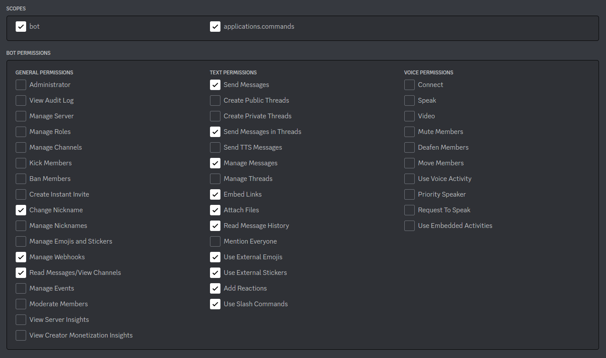

# Pin Bot

A Discord bot for getting around the 50 pinned message limit.
It sends pinned messages from a channel to a dedicated pin channel.


## Setup

1. Install [Java 17](https://adoptium.net) or higher.
2. [Create a Discord bot and get its token](https://discordpy.readthedocs.io/en/stable/discord.html). Give the bot the following permissions:



3. Create a file called `config.json` in the same directory as the bot's JAR file with the following content, replacing `123456789` with your bot's token:

```json
{
	"token": "123456789"
}
```

4. Run the bot's JAR file by running `java -jar pin-bot-VERSION.jar` in the command line, replacing `VERSION` with the version of the bot.

## Usage

1. Run the `/pin-channel set` command to set the channel where pinned messages from the current channel are sent to.
2. Make sure the channel where pinned messages are being sent from has a free pin slot, i.e. there are at most 49 pinned messages in it.
3. To send a message to the pin channel, pin it as you normally would. The bot will automatically unpin it and send it to the pin channel.
